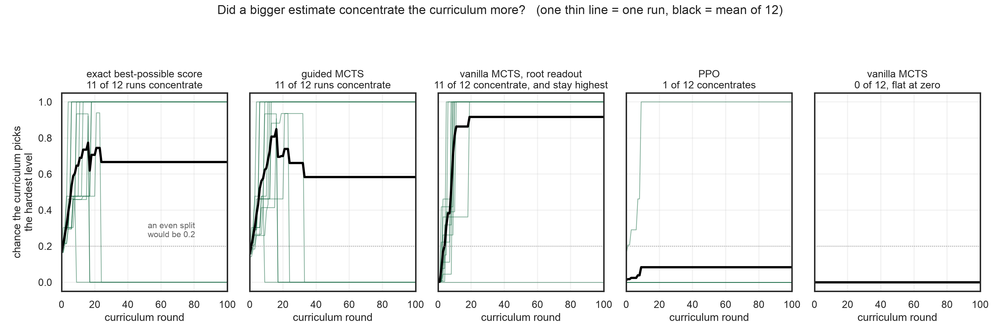
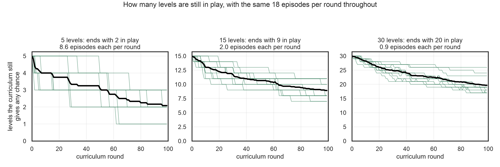
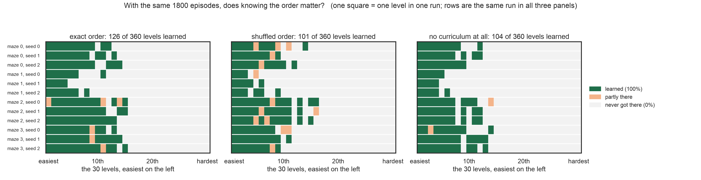
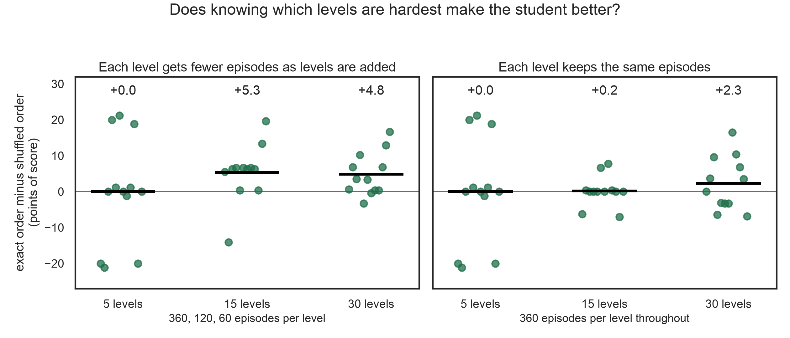
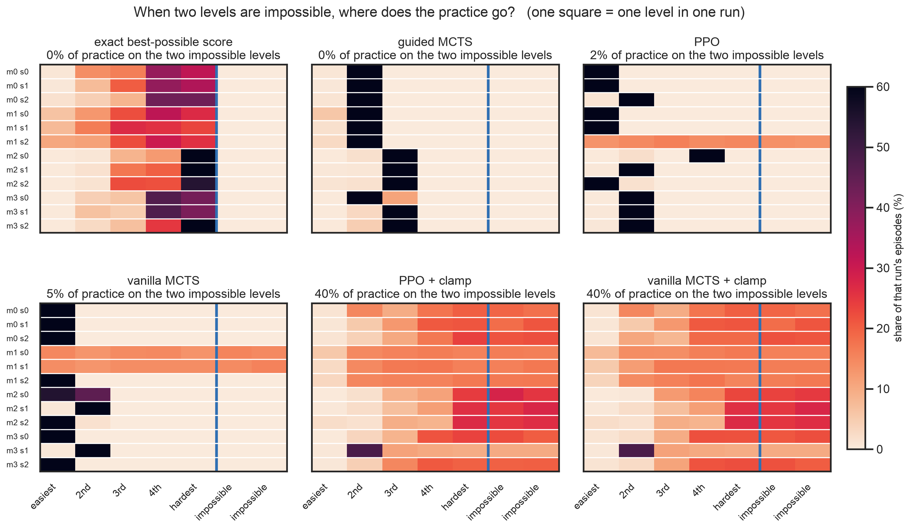
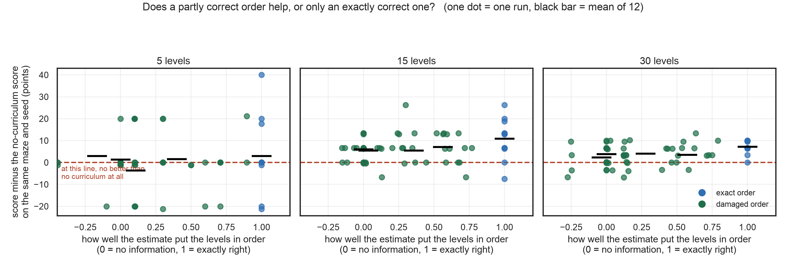

# MCTS-UED: accuracy versus support

Meeting with Eugene Vinitsky, 2026-08-18.

**How this document is built.** Part 1 defines every word used anywhere later,
including every word printed on every figure, each one built only from words defined
before it. Part 2 gives the loop with the actual arithmetic. Parts 4 to 8 are the five
figures. Each figure gets four things: a list of every visual element and what it means,
the arithmetic behind every number printed on it, why it was drawn that way instead of
some other way, and what a hostile reader attacks. Part 12 lets you rederive every
number from the raw files.

If a word appears on a figure and is not in Part 1, that is a defect. Tell me and I will
fix it.

---

# Part 1. Every word

Read in order. Nothing here uses a term defined later.

**1.1 Maze.** A 13 by 13 grid of squares, so 169 squares. Each square is a wall with
probability 0.22, drawn at random, except the top-left square which is always open. That
leaves roughly 130 open squares. The student always starts at the top-left. A maze stays
fixed for an entire run. Four different mazes are used, built from seeds 0, 1, 2, 3
upward, keeping only mazes where the levels are not all the same difficulty.

**1.2 Move.** The student picks one of four actions: up, down, left, right. Moving into a
wall or off the edge leaves it where it is. Movement is deterministic: the same action in
the same square always goes to the same place.

**1.3 Distance.** The fewest moves from the start to a square. Computed by breadth-first
search. A square at distance 14 needs at least 14 moves.

**1.4 Level.** One task. Here a level is one goal square. The maze does not change between
levels. Only which square counts as the goal changes. A level with a larger distance is
harder, because a student that knows nothing yet moves nearly at random and reaches a far
square rarely.

**1.5 Episode.** One attempt at one level. It ends when the student reaches the goal or
after 60 moves, whichever comes first.

**1.6 Episode budget.** The total number of episodes the student gets for its whole
training, added across all levels. 1800 unless stated. This is the scarce thing that this
entire experiment is about.

**1.7 Round.** The curriculum is recomputed 100 times. Each round hands out 18 episodes.
100 x 18 = 1800.

**1.8 Student.** The thing being trained. A table with one number for every combination of
square and action, updated by Q-learning. Because movement is deterministic the learning
rate is 1, meaning each update is exact rather than an average. There is no neural network
anywhere in this work.

**1.9 Exploration rate.** With probability 0.2 the student ignores its table and moves at
random. Otherwise it takes the action its table rates highest, breaking ties at random.

**1.10 Discount, 0.97.** Reaching the goal in n moves is worth 0.97 to the power (n-1).
So arriving sooner is worth more. Reaching a goal 14 moves away is worth
0.97^13 = 0.673. This is why the numbers you see on figures are between 0 and 1 rather
than being step counts.

**1.11 Score.** How good the student is on one level, as a percentage of the best
possible. 100% means it takes a shortest path. 0% means it never arrives within 60 moves.
It is computed exactly, by solving for the value of the student's current policy, not by
running sample episodes. So the score has no measurement noise whatsoever. This matters:
when a figure shows a run at exactly 0% or exactly 100%, that is exact, not a rounded
average.

**1.12 Value iteration.** The standard exact method for computing the best achievable
value of every square for a given goal: start at the goal and work outwards, repeatedly,
until no number changes by more than 1e-10. Possible here only because a maze has about
130 open squares.

**1.13 Ceiling, written V\*.** The best value any policy could achieve on that level from
the start square, computed by value iteration. **The ceiling is the only quantity in this
entire system that is ever estimated.** Everything else, including the student's score, is
computed exactly.

**1.14 Regret.** The ceiling minus what the student currently achieves, and never allowed
below zero. Plainly: how much the student is leaving on the table on that level. Large
regret means the student is bad there, which makes it worth training on. The phrase "never
allowed below zero" is load-bearing for everything that follows.

**1.15 Curriculum.** Which levels the student trains on and in what proportion.
Concretely, a probability over levels, recomputed every round.

**1.16 Generator.** The thing that produces the curriculum. Here it is one line:
probability proportional to regret. It has no parameters and it does no learning. This
matters for the meeting: it means the generator cannot be the cause of any result below.

**1.17 Solver.** The thing that estimates the ceiling. This is the piece under study. All
solvers get the same budget of 16,000 environment or model queries per level.

- **PPO** here is the simplest policy-gradient method, REINFORCE, on a table. It plays the
  level repeatedly and nudges its policy toward whatever earned reward. It is
  **model-free**, meaning it only ever learns about squares it actually stepped on.
- **vanilla MCTS** grows a search tree. It picks which branch to extend using the standard
  rule that balances trying the currently-best branch against trying under-explored ones
  (called UCT). It scores the end of a branch by playing randomly from there until the
  step limit.
- **guided MCTS** is the same tree search, except the end of a branch is scored by a
  learned value refined with one step of lookahead through the simulator, instead of by
  random play. This is the AlphaZero and MuZero idea, in table form.
- **readout** is how one number is extracted from a finished search. Two choices used
  here: the value achieved by one greedy run through the tree, or the value stored at the
  root of the tree. Identical search, different number reported. This distinction produced
  the single largest effect in the 2026-08-06 work.

**1.18 Oracle, also called the exact ceiling.** The true ceiling from value iteration. It
is not a solver. It is the answer key. Having it is what makes every claim here checkable
rather than arguable, and it is the reason this work is in a maze at all.

**1.19 Support.** Whether a level's estimated ceiling is strictly greater than zero. One
bit per level. Here is the chain: if the estimate is exactly zero, then regret is zero
(1.14), so probability is zero (1.16), so the level is never sampled. And it stays there
forever: the level is never trained on, so its score never changes, so its regret stays
zero, so its probability stays zero.

**1.20 Accuracy.** How close the estimated ceiling is to the true one, in size. This is a
different thing from support. An estimate can have support and still be wrong by a factor
of 269.

**1.21 Shuffled.** My method for removing accuracy while keeping support. Take the exact
ceilings and move them between levels. The same twelve or thirty numbers, every one still
above zero, and the only thing destroyed is which level receives which number. So the
single thing that varies is whether the curriculum knows the true ordering of difficulty.

**1.21b Noisy, and flat.** Two more ways to degrade the ceiling while keeping support.
*Noisy* multiplies each true ceiling by a random factor, at two strengths: width 0.3 means
a typical estimate is off by about 35%, width 1.0 means off by about a factor of e (2.7).
*Flat* reports one single number, the average of the true ceilings, for every level, so it
carries no information about which level is harder.

**1.21c Rank correlation.** A number from -1 to 1 saying how well one ordering matches
another. 1 means the estimated ceilings put the levels in exactly the true order of
difficulty. 0 means the ordering carries no information. Negative means it is
anti-correlated. Computed as Spearman correlation, which uses only the order and ignores
the sizes. For *flat*, every value is identical so the correlation is undefined, and it is
drawn at 0 by that convention.

**1.22 Clamp.** A one-line change: never report a ceiling below 0.01. It guarantees support
on every level no matter what the solver actually computed.

**1.23 Sealed level.** A level made genuinely impossible, so its ceiling is exactly zero.
Honest regret on it is zero forever, and every episode spent on it is thrown away.

**1.24 Detour cap.** A failure mode. If the estimated ceiling is slightly below what is
truly achievable, then the moment the student finds any policy that beats that estimate,
regret floors at zero, the level stops being sampled, and whatever imperfect route the
student happened to have at that moment is frozen in permanently. The level is capped at a
detour instead of a shortest path.

**1.25 d=N.** Shorthand for the level whose goal is N moves from the start.

**1.26 Paired comparison.** For each combination of maze and student seed, the score under
one method minus the score under another, on the identical maze with the identical seed.
Pairing removes maze-to-maze variation. That matters here because maze-to-maze variation
is larger than the effect being measured, so unpaired averages would hide it.

**1.27 Mean, median.** Mean is the average of the twelve paired differences. Median is the
middle one. Both are reported for one condition because there the differences are
symmetric with large tails, where a mean alone conceals what happened.

**1.28 SE, standard error.** The standard deviation of the twelve paired differences
divided by the square root of twelve. Rough reading: the true average is likely within
about two SE of the one printed.

**1.29 Sign test, and p.** Count how many of the twelve paired differences favour one
method, ignoring how large each is. p is the chance of getting at least that many from
coin flips. Example: 11 of 12 favouring one side has p = 0.003, meaning a 0.3% chance from
coin flips. Used because it assumes nothing about the shape of the distribution.

**1.30 Step 1 and Step 2.** Eugene's framing from 2026-07-16. Step 1: on a standard
environment, spend heavy compute to estimate regret correctly, and show the results
improve a lot, which proves regret quality is the bottleneck. Step 2: that compute is
unaffordable every round, so find a solver that estimates regret well for less, and MCTS
is the candidate. His own note at the time: Step 1 alone is obvious, the contribution is
the pair, keep both halves together.

**1.31 jaxued.** The library Eugene sent on Slack, github.com/DramaCow/jaxued. A standard
Maze environment with PAIRED, PLR and ACCEL implemented, so results in it are comparable
to published work. Nothing in this document is in it yet.

---

# Part 2. The loop, with the arithmetic

One hundred rounds. Each round:

1. Measure the student's score on every level. **Exact** (1.11).
2. For each level: regret = estimated ceiling - (score x true ceiling), floored at zero.
   *Worked example, d=14 in a typical maze: true ceiling 0.673. If the student currently
   scores 0%, its value is 0.00, so regret = estimated ceiling - 0.00. If the solver
   estimated 0.0025, regret is 0.0025. If it estimated exactly 0, regret is 0.*
3. Probability of each level = its regret / the sum of all regrets. If every regret is
   zero there is nothing to divide by, so the previous round's probability is kept.
   *Worked example, five levels where four are mastered (regret 0) and one has regret
   0.0025: probability = 0.0025 / 0.0025 = 1.0 on that one level and 0 on the rest. Note
   this is the same answer you would get if its regret were 0.673. This single fact is
   what Figure 1 shows.*
4. Draw 18 levels from that probability, with replacement, and run one episode on each.
   Update the student's table.

At the end, measure the score on every level. **Exact.**

Every experiment in this document changes step 2's **estimated ceiling** and nothing else.
Same student, same generator, same mazes, same seeds, same budget, same number of rounds.

Settings held fixed everywhere: maze 13x13, wall probability 0.22, discount 0.97, episode
limit 60 moves, exploration rate 0.2, learning rate 1, solver budget 16,000 queries per
level, 4 mazes x 3 seeds = 12 runs per cell.

---

# Part 3. What 2026-08-06 established, and why it looked terminal

For each combination of method and level, ask: what percentage of the 12 runs reported a
ceiling above zero for that level? That percentage predicts the score the student actually
reached, to within **0.06 points on average and 0.5 points at worst, across all 25 cells**
(5 estimate-driven methods x 5 levels).

One bit per level explained the entire outcome table. Two consequences looked fatal:

1. **Accuracy was worth nothing.** Vanilla MCTS read out at the root estimates the d=11
   ceiling at 0.0128 against a true 0.7374. That is wrong by a factor of 58. It scores
   100%.
2. **The clamp was free.** It took PPO from 8.3% to 99.5% on the worst level, which is
   the same 99.5% guided MCTS reaches, down to the same single run at 94.1%.

If one line of code buys what a 4x cheaper solver buys, Step 2 has nothing to prove. The
rest of this document is about why that reading is wrong, and exactly what conditions it
depends on.

---

# Part 4. Figure 1. Did a bigger estimate concentrate the curriculum more?



This uses per-round data the 2026-08-06 runs recorded and that was never plotted: 101
rounds per run, 72,720 numbers in total.

## 4.1 Every element on this figure

The title, printed verbatim on the figure:

> **Did a bigger estimate concentrate the curriculum more?   (one thin line = one run, black = mean of 12)**

| element | meaning |
| --- | --- |
| "Did a bigger estimate concentrate the curriculum more?" | the question the figure answers. The answer, visible in the panels, is no |
| "(one thin line = one run, black = mean of 12)" | there are 12 runs per panel, each drawn as one thin green line; the thick black line is their average at each round |
| five panels | one per source of the estimated ceiling |
| panel headings "exact ceiling", "guided MCTS", "vanilla MCTS root readout", "PPO", "vanilla MCTS" | the five sources, defined at 1.17 and 1.18 |
| "reports 0.673 / 0.635 / 0.0025 / 0.053 / exactly 0" | the average ceiling that source reported for the hardest level, across its 12 runs. The true value is 0.673 |
| x axis, "curriculum round" | which of the 100 rounds, defined at 1.7 |
| y axis, "chance the curriculum picks the hardest level" | the probability from step 3 of Part 2, for the d=14 level, at that round. Runs 0 to 1 |
| thin green line | one run. 12 per panel |
| thick black line | the average of those 12 at each round |
| dotted horizontal line at 0.2 | what an even split over 5 levels gives, 1/5 = 0.2. A line above it means that level is favoured |
| the label "an even split would be 0.2" | names that dotted line |

## 4.2 Every number, rederived

| printed | how to get it |
| --- | --- |
| reports 0.673 (exact) | mean of `v_hat[4]` over the 12 oracle runs. Equals the true ceiling by definition |
| reports 0.0025 (root readout) | mean of `v_hat[4]` over the 12 mcts_root runs |
| 269x too small | 0.6730 / 0.0025 = 269 |
| root readout ends near 0.92 | mean of `curve[-1][2][4]` over its 12 runs = 0.917 |
| exact ceiling ends near 0.67 | same field for oracle = 0.667 |
| 6,060 values drawn | 5 panels x 12 runs x 101 rounds |

## 4.3 What it shows, and why that is the mechanism

The answer to the title is **no**. The source reporting 0.0025, which is 269 times too
small, settles at **0.917** probability on the hardest level. The source reporting the
exactly correct 0.673 settles at **0.667**. The wrong one concentrates *harder* than the
right one.

The reason is step 3 of Part 2. Regret is normalised. Once the easy levels are mastered
their regret floors at zero, so whatever regret remains takes the whole probability
regardless of its size. You can watch that collapse happen between rounds 5 and 20 in the
first three panels. The size of the estimate never enters the calculation.

The two right-hand panels show the other half. PPO reports 0.053 and gets 0.083. Vanilla
MCTS reports exactly zero and gets exactly zero, flat across all 100 rounds in all 12
runs. Zero is the single value that behaves differently, and the reason is 1.19.

## 4.4 Why drawn this way

I plot every run rather than a summary because the collapse timing varies between runs and
an average alone would look like a smooth ramp. The lines that fall back to zero after
round 20 in the first panel are runs where the hardest level got mastered, so its regret
went to zero legitimately. That is visible only if runs are drawn individually.

## 4.5 What gets attacked

*"You are showing d=14 only."* Correct, and that is the level where every method differs.
The four easier levels are mastered by every method, so their probabilities all go to zero
early and the panels would be identical.

*"The black mean line crosses runs that ended."* Yes. After a run masters the level its
line drops to zero and pulls the mean down. That is why the mean settles at 0.667 rather
than 1.0, and why the individual lines matter more than the mean here.

---

# Part 5. Figure 2. Why a short budget makes the ranking matter



## 5.1 Every element

The title, printed verbatim on the figure:

> **Why a short budget makes the ranking matter: how many levels compete for the same 18 episodes per round**

| element | meaning |
| --- | --- |
| "Why a short budget makes the ranking matter" | the question. "Short budget" means 1800 episodes for however many levels exist |
| "how many levels compete for the same 18 episodes per round" | what the y axis counts. 18 is fixed in all three panels (1.7) |
| three panels, "5 levels", "15 levels", "30 levels" | how many levels exist in that condition. The episode budget is 1800 in all three, so it is spread thinner as levels are added |
| "ends with 2 / 9 / 20 competing" | how many levels still have a nonzero chance at the final round, averaged over 12 runs |
| "8.6 / 2.0 / 0.9 episodes each per round" | 18 divided by the number above |
| x axis, "curriculum round" | which of the 100 rounds |
| y axis, "levels the curriculum still gives a nonzero chance" | count of levels whose probability exceeds 1e-9 at that round |
| thin green line | one run, 12 per panel |
| thick black line | their average |

## 5.2 Every number, rederived

| printed | how |
| --- | --- |
| 5 levels ends with 2 | mean over 12 runs of the count of `curve[-1][2]` entries above 1e-9 = 2.08 |
| 8.6 episodes each | 18 / 2.08 = 8.64 |
| 15 levels ends with 9 | same = 8.92, and 18 / 8.92 = 2.02 |
| 30 levels ends with 20 | same = 19.67, and 18 / 19.67 = 0.92 |
| 3,600 values drawn | 3 panels x 12 runs x 100 rounds |

## 5.3 What it shows

At five levels the curriculum ends with about two levels in play, so each gets about 8.6
episodes per round. At thirty levels it ends with about twenty in play, so each gets about
0.9.

That is the whole mechanism in one number. With two candidates and 18 episodes you can
afford both, so their ordering does not change what gets trained. With twenty candidates
and 18 episodes you cannot cover them, so the ordering decides which ones get trained.
This is why Figures 3 and 4 find what they find, and it is why the 2026-08-06 design could
not have found it.

## 5.4 Why drawn this way

The count of competing levels is the quantity that actually links budget to ranking, so I
plot it directly rather than plotting score and asking you to infer the cause. The
derived "episodes each per round" is in the panel title because it is the number that
makes the point, and it is a division you can check by eye.

## 5.5 What gets attacked

*"1e-9 is an arbitrary cutoff."* The probabilities here are either exactly zero, because
regret floored at zero, or well above 1e-3. There is nothing near the cutoff, so any
threshold between 1e-12 and 1e-3 gives the same curves.

*"You only show the exact-ceiling runs."* Yes, because this figure is about the budget and
the level count, not about the estimate. The shuffled runs give the same picture: 2.4, 10.0
and 22.6 competing at the end.

---

# Part 6. Figure 3. Does knowing the ranking master more levels?



## 6.1 Every element

The title, printed verbatim on the figure:

> **With the same 1800 episodes, does knowing the ranking master more levels?   (one square = one level in one run; rows are the same run in all three panels)**

| element | meaning |
| --- | --- |
| "With the same 1800 episodes" | both panels use the identical budget (1.6), so this is not a compute comparison |
| "does knowing the ranking master more levels" | the question. "Ranking" means the ordering of levels by true difficulty (1.21) |
| "one square = one level in one run" | there are 12 x 30 = 360 squares per panel |
| "rows are the same run in all three panels" | row 1 of each panel is the same maze and the same student seed, so a row can be compared straight across |
| left panel, "exact ranking" | the estimated ceiling equals the true ceiling |
| middle panel, "shuffled ranking" | the same ceilings moved between levels, defined at 1.21 |
| right panel, "no curriculum at all" | every level sampled with equal probability, ignoring regret entirely. This is the baseline |
| "126 / 101 / 104 of 360 levels mastered" | count of squares at exactly 100% in that panel |
| row labels "maze 0, seed 0" and so on | which of the 4 mazes and which of the 3 student seeds. 4 x 3 = 12 rows |
| x axis, "the 30 levels, easiest on the left" | levels ordered by their true ceiling within that run, so column 1 is that run's easiest level |
| x tick labels "easiest, 10th, 20th, hardest" | position in that ordering |
| dark green square | the student ended at exactly 100% on that level |
| pale orange square | partly solved, above 0% and below 100% |
| light grey square | never reached the goal, exactly 0% |
| the legend at the right | names those three colours |

## 6.2 Every number, rederived

| printed | how |
| --- | --- |
| 360 squares per panel | 12 runs x 30 levels |
| 126 mastered, exact | count of `final` entries at or above 0.999 across the 12 oracle runs. Cross-check: the per-run counts are 4, 7, 7, 11, 11, 11, 11, 12, 13, 13, 13, 13 and they sum to 126 |
| 101 mastered, shuffled | same for shuffle. Per-run: 3, 5, 6, 8, 8, 8, 8, 10, 10, 11, 11, 13, summing to 101 |
| 104 mastered, no curriculum | same for uniform |
| the grey right-hand half | 228 of 360 squares are at exactly 0% for exact, 245 of 360 for shuffled |

## 6.3 Why a matrix instead of an average

Because the outcome on a level is almost binary. Across the 360 exact-ceiling
level-outcomes: **228 are exactly 0%, 126 are exactly 100%, and only 6 are anywhere in
between.** So a "mean score across levels" is really a count of mastered levels wearing a
disguise, and the honest display is that count, drawn as the individual outcomes it is
made of.

## 6.4 What it shows, including the baseline

126 of 360 with the exact ranking, 101 with the shuffled one, and **104 with no
curriculum at all**, on identical mazes with identical seeds.

That third number is the one to lead with, and it is uncomfortable for the simple story.
The exact ranking beats no curriculum by 22 levels. The shuffled ranking does **not**
beat no curriculum on this metric at all; it is 3 levels behind it.

Being careful, because this does not hold uniformly. Across all three level counts:

| levels | exact | shuffled | no curriculum |
| --- | --- | --- | --- |
| 5 | 35 of 60 (64.5%) | 34 of 60 (64.5%) | 36 of 60 (61.6%) |
| 15 | 73 of 180 (45.3%) | 70 of 180 (39.9%) | 62 of 180 (34.4%) |
| 30 | 126 of 360 (36.6%) | 101 of 360 (31.7%) | 104 of 360 (29.4%) |

Counts are levels mastered, percentages in brackets are mean score. On **mean score** the
order is exact, then shuffled, then no curriculum, at every level count. On **levels
mastered** the shuffled ranking beats no curriculum at 15 levels and slightly loses to it
at 30, and at 5 levels no curriculum is nominally highest.

So the defensible claim is about the exact ranking rather than about curricula in general:
a regret curriculum clearly beats uniform sampling when its ranking is right, and when the
ranking is destroyed its advantage over uniform sampling becomes small and metric-dependent.

**Say this before he does.** The right-hand half of both panels is grey. Under 1800
episodes, no curriculum ever reaches the hardest fifteen of the thirty levels. So the
claim is not that the ranking conquers hard levels. The claim is that it gets further into
the middle before the budget runs out.

## 6.5 What gets attacked

*"Columns are not the same level across rows."* Correct. Each maze has different goal
distances, so column 7 means "that run's 7th easiest level", not one fixed level. That is
stated on the axis. The alternative, a common distance axis, is impossible because the
mazes do not share distances.

*"126 versus 101 could be one lucky run."* Look at the rows. The exact panel beats the
shuffled panel in 10 of 12 paired rows. Figure 4 quantifies that, and 7.6 tests whether it
is one lucky maze.

*"Why does no curriculum master 104 while scoring lower than shuffled's 101?"* Because
mastered count and mean score reward different things. Uniform sampling spreads episodes
evenly, which masters a few more easy levels outright while leaving more levels at exactly
0%. The shuffled curriculum concentrates on fewer levels and picks up partial credit on
more of them: 14 of its 360 outcomes are partly solved against 6 for the exact ranking.
Both numbers are in the table above, and I would rather show both than pick the flattering
one.

---

# Part 7. Figure 4. And only when the budget is short



## 7.1 Every element

The title, printed verbatim on the figure:

> **Does knowing which levels are hardest make the student better?**

| element | meaning |
| --- | --- |
| "Does knowing which levels are hardest" | whether the estimated ceilings are in the true order across levels, which is exactly what shuffling destroys (1.21) |
| "make the student better" | "better" means a higher score (1.11) averaged over that run's levels. Nothing else |
| left panel, "Each level gets fewer episodes as levels are added" | the total budget stays at 1800, so per-level episodes fall |
| "360, 120, 60 episodes per level" | 1800/5, 1800/15, 1800/30 |
| right panel, "Each level keeps the same episodes" | the budget grows with the level count |
| "360 episodes per level throughout" | 1800, 5400 and 10800 episodes total |
| x tick labels "5 levels, 15 levels, 30 levels" | the three conditions |
| y axis, "exact ranking minus shuffled (points of score)" | one dot is one run's score with the exact ceiling minus the same run's score with the shuffled one. Positive means the exact ranking helped |
| green dot | one run. 12 per column |
| black horizontal bar | the mean of those 12 |
| the number above each column | that mean |
| grey horizontal line at 0 | no difference. Above it the ranking helped, below it the ranking hurt |

## 7.2 Every number

| levels | left panel | right panel |
| --- | --- | --- |
| 5 | +0.01, SE 4.32, median +0.0, 5 of 12 favour exact with 3 ties, p 0.50 | identical by construction |
| 15 | **+5.33, SE 2.31, median +6.3, 11 of 12, p 0.003** | +0.16, SE 1.21, median +0.0, 5 of 12 with 5 ties, p 0.23 |
| 30 | **+4.84, SE 1.74, median +3.4, 10 of 12, p 0.019** | +2.29, SE 2.14, median +1.8, 6 of 12 with 1 tie, p 0.50 |

The 5-level column is identical in both panels because at five levels a total budget of
1800 and a per-level budget of 360 are the same thing. It is there as a check that the two
panels agree where they must.

## 7.3 Why the right panel exists, in full

I choose levels like this: sort every open square by its distance, cut that sorted list
into as many equal-sized slices as there are levels, and draw one goal at random from each
slice. With 5 levels, the last slice is the hardest 20% of squares. With 30 levels, the
last slice is the hardest 3.3%. So the hardest level creeps up as levels are added.
Measured: the hardest level is at distance 19 to 23 across the four mazes at 5 levels, and
22 to 27 at 30 levels.

That makes **"the levels simply got harder"** a competing explanation for the left panel,
separate from **"the levels are competing for a shorter budget"**. The right panel
separates them. It keeps the level count and it keeps the difficulty range, and removes
only the shortage, by growing the budget so each level still gets 360 episodes. The effect
goes away with the shortage: +0.16 and +2.29, neither distinguishable from coin flips.

A second check that the right panel is normalised correctly: the exact ceiling scores
64.5%, 63.6% and 65.3% at 5, 15 and 30 levels there. Flat. That is what you expect if
every level really is getting the same learning opportunity.

## 7.4 The 5-level column is not "no effect"

Its twelve paired differences are:

```
-21.2  -20.0  -20.0  -1.2  0.0  0.0  0.0  +1.2  +1.2  +18.9  +20.0  +21.2
```

Three runs lose 20 points, three gain 20, and it averages to +0.01. At five levels the
ceiling estimate is a **coin flip with a large spread**, not a harmless irrelevance. The
scatter shows that directly, which is why I plot all twelve dots rather than a mean and an
error bar.

## 7.6 Is it one lucky maze?

He will ask this, so I checked it directly. Per-maze mean of the paired difference, fixed
1800 budget:

| levels | maze 0 | maze 1 | maze 2 | maze 3 | all four |
| --- | --- | --- | --- | --- | --- |
| 15 | -0.8 | +4.6 | +6.4 | +11.1 | +5.33 |
| 30 | +3.7 | +3.4 | +0.1 | +12.2 | +4.84 |

At 30 levels **all four mazes are non-negative**. At 15 levels three of four are positive.
Maze 3 is roughly three times the others in both, so it does inflate the average.

Leave-one-maze-out, which is the test that matters:

| dropped | 15 levels | 30 levels |
| --- | --- | --- |
| maze 0 | +7.36 | +5.23 |
| maze 1 | +5.58 | +5.32 |
| maze 2 | +4.97 | +6.41 |
| maze 3 | +3.40 | +2.40 |

The effect survives dropping any single maze. Worst case is dropping maze 3, which leaves
+3.40 at 15 levels and +2.40 at 30. So the direction does not depend on one maze, but the
size does vary by maze by a factor of about three, and with four mazes I cannot say why.

## 7.5 What gets attacked

*"p 0.50 at 30 levels in the right panel, but the mean is +2.29. Is the effect there or
not?"* The honest answer is that I cannot tell. 6 of 12 favouring exact is a coin flip, so
the mean is driven by a few large positives. What I can say is that the effect is not
distinguishable from zero there, while in the left panel at 15 levels it is 11 of 12.

*"You are averaging over four different mazes."* Every comparison is paired within a maze
and within a seed (1.26), so maze-to-maze variation cancels.

---

# Part 8. Figure 5. What happens when a level cannot be solved at all



## 8.1 Every element

The title, printed verbatim on the figure:

> **When two levels cannot be solved at all, where does the training go?   (one square = one level in one run)**

| element | meaning |
| --- | --- |
| "When two levels cannot be solved at all" | two of the seven levels are sealed, so their ceiling is exactly zero (1.23) |
| "where does the training go" | which levels received the episodes. The colour of a square is that share |
| six panels | one per source of the estimated ceiling. Top row is without the clamp, bottom row has the two clamped versions plus vanilla MCTS |
| panel headings | the source, then how much of training that source sent to the two impossible levels |
| row labels "m0 s0" | maze 0, seed 0. 12 rows per panel |
| x tick labels "easiest, 2nd, 3rd, 4th, hardest, sealed, sealed" | five solvable levels ordered by true ceiling, then the two sealed levels |
| the blue vertical line | the boundary. Everything to its right is a sealed level where the ceiling is exactly zero |
| cell colour, pale to black | the share of that run's 1800 episodes that went to that level. The colour bar runs 0% to 60% |
| the colour bar label "share of that run's episodes (%)" | names that scale |

## 8.2 How the sealed levels were made

At 22% walls a 13x13 maze always comes out fully connected, so there are no naturally
unreachable squares to use. So I made two. I picked **dead ends**, squares with exactly one
neighbour, and removed the moves that enter them. Nothing routes through a dead end, so
removing it cannot lengthen any other level's shortest path. Then I recomputed all the
ceilings on the modified maze, and every method uses the same modified maze. A sealed
level's ceiling comes out of value iteration as exactly 0.0, which you can see in the data:
one run's ceilings are `[0.833, 0.737, 0.673, 0.614, 0.578, 0.0, 0.0]`.

## 8.3 Every number

| source | score on solvable levels | training on sealed levels | solvable levels mastered |
| --- | --- | --- | --- |
| exact ceiling | 64.7% | 0.0% | 3.00 of 5 |
| vanilla MCTS + clamp | 61.5% | 39.5% | 2.92 of 5 |
| PPO + clamp | 58.1% | 39.9% | 2.75 of 5 |
| guided MCTS | 50.0% | 0.0% | 2.50 of 5 |
| PPO | 34.9% | 2.2% | 1.67 of 5 |
| vanilla MCTS | 28.2% | 5.0% | 1.33 of 5 |

504 squares total: 6 methods x 12 runs x 7 levels.

Paired within maze and seed, the clamp adds **+37.7 points** of wasted budget for **+23.2
points** of score on PPO, and **+34.5** wasted for **+33.2** score on vanilla MCTS.

## 8.4 What it shows

In the top row, the region right of the blue line is pale. In the bottom middle and bottom
right, the clamped runs, the colour continues straight through the blue line. Both clamped
methods spend about 40% of all training on levels no student can ever solve.

**Say all of this before he does.** The clamp is still worth using here. Two of seven
levels are impossible, 40% of training is thrown away, and it still gains 23 to 33 points
of score, because a curriculum frozen at zero regret is worse than a wasteful one. And
clamped vanilla MCTS at 61.5% **outscores guided MCTS at 50.0%** while wasting that 40%.
Only the exact ceiling is good on both counts at once, at 64.7% and 0%.

## 8.5 What gets attacked

*"PPO wastes 2.2% and vanilla MCTS 5.0% without a clamp. Why not exactly 0%?"* I checked
every run. Of the 24 unclamped runs across those two methods, exactly **three** wasted any
budget at all:

| run | wasted | its ceilings on the two sealed levels |
| --- | --- | --- |
| PPO, maze 1, seed 2 | 26.9% | 0.0 and 0.0 |
| vanilla MCTS, maze 1, seed 1 | 30.1% | 0.0 and 0.0 |
| vanilla MCTS, maze 1, seed 0 | 29.9% | 0.0 and 0.0 |

All three reported the sealed ceilings correctly as exactly zero, so this is not an
estimation error. It is step 3 of Part 2: their regret hit zero on **every** level at once,
so there was nothing to divide by, and the code held the previous round's probability while
that probability was still near uniform. Uniform over 7 levels sends 2/7 = 28.6% to the
sealed pair, which is what those three numbers are.

The reported averages are entirely those three runs: 26.9 / 12 = 2.24% for PPO, shown as 2.2% in the table above, and
(30.1 + 29.9) / 12 = 5.0% for vanilla MCTS. So this is the frozen-generator failure from
2026-08-06 reappearing, and it has nothing to do with the clamp.

*"Is 40% just a badly chosen threshold?"* Possibly, and the sweep is not done. But no
positive threshold can distinguish a level whose ceiling was underestimated from a level
whose ceiling is truly zero, because the clamp sees only the number and not the reason.
Lowering the threshold lowers the waste and lowers the rescue with it.

---

# Part 8b. Figure 6. Does a partly correct ordering help, or only an exactly correct one?



This figure exists because of a question I could not answer from Figures 3 and 4. Those
compare a perfect ordering against a destroyed one, which are the two endpoints. It leaves
open whether the benefit arrives gradually as the ordering improves, or only at the end.
The answer changes what Step 2 needs from a solver: a gradual benefit means any
improvement in the solver pays off, while a benefit only at the end means approximate
solvers are worth nothing.

## 8b.1 Every element

The title, printed verbatim:

> **Does a partly correct ordering help, or only an exactly correct one?   (one dot = one run, black bar = mean of 12)**

| element | meaning |
| --- | --- |
| three panels, "5 levels", "15 levels", "30 levels" | the three level counts, all at the fixed 1800-episode budget |
| x axis, "how well the estimate ranked the levels (0 = no information, 1 = exactly right)" | the rank correlation (1.21c) between that run's estimated ceilings and the true ones |
| y axis, "score minus the no-curriculum score on the same maze and seed (points)" | that run's score minus the score of the no-curriculum run on the identical maze with the identical seed. Positive means the curriculum beat uniform sampling |
| blue dot | a run using the exact ceiling, so its rank correlation is 1.00 |
| green dot | a run using one of the four degraded ceilings: noise at width 0.3, noise at width 1.0, flat, or shuffled (1.21, 1.21b) |
| black bar | the mean of the 12 runs in that group, drawn at that group's mean correlation |
| red dashed line at 0 | no better than no curriculum at all |
| the red label | names that line |

## 8b.2 Why it is paired, which matters here more than anywhere else

I first drew this unpaired, with the raw score on the y axis, and it was unreadable: at 30
levels the exact-ceiling runs alone span 13% to 46% score, so maze-to-maze variation buries
a 7-point effect completely. Subtracting the no-curriculum run from the same maze and the
same seed removes that variation. This is the clearest demonstration in the whole document
of why every comparison here is paired (1.26).

## 8b.3 Every number

| levels | source | rank correlation | versus no curriculum | runs better |
| --- | --- | --- | --- | --- |
| 15 | exact | +1.00 | **+10.82 pts** | 10 of 12 |
| 15 | noise 0.3 | +0.56 | +7.09 | 8 of 12 |
| 15 | noise 1.0 | +0.36 | +5.46 | 8 of 12 |
| 15 | flat | +0.00 | +6.01 | 8 of 12 |
| 15 | shuffled | +0.03 | +5.49 | 8 of 12 |
| 30 | exact | +1.00 | **+7.14 pts** | 11 of 12 |
| 30 | noise 0.3 | +0.57 | +3.48 | 9 of 12 |
| 30 | noise 1.0 | +0.28 | +4.07 | 9 of 12 |
| 30 | flat | +0.00 | +3.79 | 8 of 12 |
| 30 | shuffled | -0.04 | +2.30 | 7 of 12 |

## 8b.4 What it shows

**It is a step, not a ramp.** At both 15 and 30 levels the exact ordering roughly doubles
what any degraded ordering achieves: +10.82 against +5.5 to +7.1, and +7.14 against +2.3 to
+4.1. And the four degraded versions are indistinguishable from one another. A correlation
of +0.57 does no better than a correlation of 0.00, and at 30 levels noise at width 1.0
(+4.07, correlation 0.28) nominally beats noise at width 0.3 (+3.48, correlation 0.57).

So the useful quantity is not "how accurate is the solver". Partial accuracy in the ordering
buys nothing measurable over having no ordering information at all. What the curriculum
needs is the ordering exactly right, or it may as well be arbitrary.

Two things this does **not** say. Every degraded curriculum still beats no curriculum by
about +2 to +6 points, so a wrong ordering is better than not trying to order at all. And
at 5 levels nothing works: every group is within a couple of points of zero, and noise at
width 1.0 is actually negative, which is the same no-competition regime Figures 2 and 4
identify.

## 8b.5 What gets attacked

*"Flat has an undefined correlation and you drew it at zero."* Stated on the figure and at
1.21c. Flat reports the same number everywhere, so it genuinely carries no ordering
information, which is what zero means here. Dropping it entirely does not change the
conclusion, because shuffled is also at approximately zero and lands in the same place.

*"With 12 runs per group you cannot separate +3.48 from +4.07."* Correct, and that is the
point. The degraded groups are not separable from each other. What is separable is exact
against degraded: 11 of 12 runs versus 7 to 9 of 12, and roughly double the mean.

*"This contradicts your earlier claim that shuffled does not beat no curriculum."* It does
not. That earlier claim was about **levels mastered**, where shuffled is 101 against
uniform's 104. This figure is about **mean score**, where shuffled is +2.30 ahead. Both are
in Part 6.4, and the disagreement between the two metrics is stated there.

---

# Part 9. The reasoning, one step per line

1. The generator is one line, probability proportional to regret, with no parameters
   (1.16). So no result here can be blamed on the generator.
2. The student, mazes, seeds, budget and round count are identical across methods. The
   estimated ceiling is the only thing that differs (Part 2).
3. Regret is floored at zero (1.14), so a ceiling reported as exactly zero gives that
   level probability zero.
4. A level at probability zero is never trained on, so its score never changes, so its
   regret stays zero and its probability stays zero for the rest of training (1.19). This
   is support, one bit per level.
5. Probability is regret divided by total regret, so the remaining regret takes the whole
   probability regardless of its size. **Figure 1 measures this**: a ceiling 269x too small
   yields 0.917 probability, more than the exact ceiling's 0.667.
6. Therefore, when few levels are unmastered at the same time, the size of the estimate
   cannot affect the allocation. Only zero-versus-nonzero can. This is why 2026-08-06 found
   one bit explaining all 25 cells.
7. How many levels are unmastered at the same time is set by the budget relative to the
   level count. **Figure 2 measures this**: about 2 competing at five levels, about 20 at
   thirty, which is 8.6 down to 0.9 episodes each per round.
8. Once about 20 levels compete for 18 episodes, the ordering decides which get trained.
   **Figure 3 measures the consequence**: 126 of 360 levels mastered against 101.
9. The cause is the shortage rather than the level count or the difficulty. **Figure 4
   shows this**: growing the budget with the level count removes the effect, leaving +0.16
   and +2.29, neither distinguishable from zero.
10. The clamp guarantees support without knowing anything about the level (1.22). When a
    level's ceiling is genuinely zero, that guarantee is a false claim about the world, and
    **Figure 5 prices it** at about 40% of the training budget.
11. A solver can tell an underestimated ceiling from a genuinely zero one. The clamp
    cannot, because it sees only the number. That distinction is what solver quality buys,
    and it is invisible in a design where every level is solvable.
12. The benefit of a correct ordering does not arrive gradually. **Figure 6 measures this**:
    an ordering that is 57% correct does no better than one that is 0% correct, and only an
    exactly correct ordering separates, at roughly double the benefit. So an approximately
    better solver is worth nothing here, which is a harder requirement on Step 2 than
    "estimate regret more accurately".

---

# Part 10. The three decisions I want from the hour

1. **Is "support that respects a true zero" the Step 2 claim?** If yes, the next thing to
   build is a floor applied only where the solver is uncertain, and never where it
   confidently reports zero. That design follows from Figure 5 and is untested.
2. **Which V\* counts as regret?** Open since July 16. In-pool column-max gives a mixed
   minimax at value 4.2. A freshly trained best response gives a pure one at 82.5. Every
   "reaches the minimax" statement I have is relative to a choice we have not made, and it
   fixes the target for the jaxued runs.
3. **What level count do we port to jaxued at?** Porting at five levels would reproduce a
   regime where the ranking provably does not matter. Fifteen is the cheapest count where
   it does.

---

# Part 11. What I am not claiming

- Not that guided MCTS is the right solver. With unsolvable levels present it loses on
  score to a clamped baseline, 50.0% against 61.5%.
- Not that the clamp is unsafe. It is wasteful and still worth using in the setting I
  tested.
- Not Nash. Where the July toy converged, it converged to a regularised equilibrium.
- Not that accuracy matters in general. It matters when levels compete for a short budget,
  which is a condition I can state, measure, and switch off.
- Not that worst-level score is usable here. It saturated at exactly 0 for every method in
  both new experiments, because the level sets contain goals nothing masters in 1800
  episodes. Mean score and levels-mastered are what discriminate.
- Not that any of this survives outside a tabular maze. That is the next work.

---

# Part 12. Rederive every number yourself

Files in `data/`:

| file | what |
| --- | --- |
| `aug06_student_curriculum.json` | the 2026-08-06 runs. Parts 3 and 4 |
| `accuracy_vs_support.json` | the level-count sweep at a fixed 1800 budget. Parts 6, 7 |
| `accuracy_perlevel_budget.json` | the control, budget scaled with level count. Part 7 |
| `accuracy_vs_support_curves.json` | the same sweep with per-round trajectories. Part 5 |
| `clamp_safety.json` | the sealed-level experiment. Part 8 |

Fields on every run: `method`, `maze`, `seed`, `n_levels`, `final` (per-level score),
`alloc` (per-level share of episodes), `v_hat` (estimated ceilings), `v_opt` (true
ceilings), `n_mastered`, `wasted_alloc`, and in the `_curves` file `curve`, a list of
`[episodes so far, per-level scores, per-level probability]` per round.

| claim | recipe |
| --- | --- |
| one bit predicts all 25 cells | per (method, level): share of runs with `v_hat[i] != 0`, against mean `final[i]` |
| 0.0025 gets 0.917 probability | mean of `curve[-1][2][4]` over the 12 mcts_root runs |
| 2 vs 20 competing | count entries of `curve[-1][2]` above 1e-9, mean over runs |
| 126 vs 101 mastered | count `final` entries at or above 0.999, `n_levels == 30` |
| outcomes are 228 / 126 / 6 | histogram of `final` at `n_levels == 30` for oracle |
| +5.33 at 15 levels | pair on (maze, seed), oracle `mean` minus shuffle `mean`, times 100 |
| 40% wasted | mean of `wasted_alloc`, times 100 |

Check every number in this document:

```
uv run --with numpy,scipy python verify_numbers.py
```

It prints one line per claim, 180 of them, and exits nonzero if any disagrees with the
data. It covers the glossary arithmetic, all six figures, both statistical tables, the
per-maze and leave-one-maze-out robustness, and the quoted 2026-08-06 numbers.

Regenerate everything from `code/`:

```
uv run --with numpy,scipy python accuracy_vs_support.py oracle
uv run --with numpy,scipy python accuracy_vs_support.py perlevel
uv run --with numpy,scipy python accuracy_vs_support.py clamp
CURVES=1 uv run --with numpy,scipy python accuracy_vs_support.py oracle
uv run --with numpy,matplotlib,seaborn python make_figures.py
```

Runtimes on this laptop: `oracle` about 4 minutes, `clamp` about 12, `perlevel` about 25.
Every run is seeded from a fixed value, so the numbers reproduce exactly. `mcts_vs_ppo_regret.py`
is the shared library holding the maze builder, value iteration, and the three solvers;
`accuracy_vs_support.py` imports from it.
